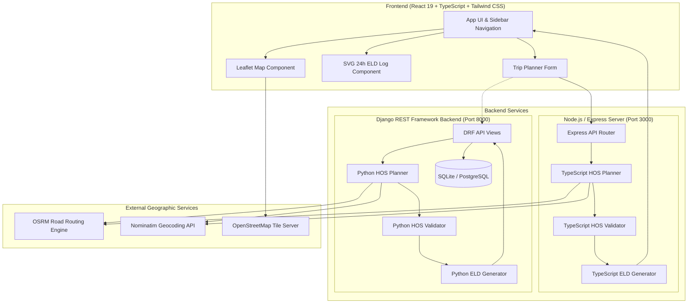

# RouteLedger

### Commercial Route & HOS Planning

[](https://react.dev/)
[](https://www.typescriptlang.org/)
[](https://vitejs.dev/)
[](https://tailwindcss.com/)
[](https://leafletjs.com/)
[](https://www.python.org/)
[](https://www.djangoproject.com/)
[](https://www.django-rest-framework.org/)

RouteLedger is a full-stack commercial route planning and Hours-of-Service (HOS) compliance engine built for property-carrying commercial motor vehicles (CMVs). The application calculates road-network truck routes, evaluates federal statutory rest and shift requirements under **FMCSA 49 CFR Part 395**, schedules required cargo handling and rest stops, renders interactive map geometry, generates official 24-hour Records of Duty Status (RODS) driver log sheets with vector duty graphs, and audits the entire dispatch through an independent validation pass.

---

## Live Demo & Repository

- **Live Application**: [RouteLedger Live Preview](https://ais-dev-yyrsjzyfd62jrpe5wiedqb-1004040337846.asia-southeast1.run.app)
- **Primary Use Case**: Property-carrying interstate commercial trucking (70-hour / 8-day cycle)

---

## Overview

Interstate trucking in the United States is governed by strict federal safety limits designed to prevent driver fatigue. Planning a commercial trip requires far more than calculating standard driving distance: dispatchers and drivers must interlock road mileage with mandatory loading time, non-extendable 14-hour daily duty windows, 11-hour driving caps, mandatory 30-minute rest breaks, diesel fueling intervals, and cumulative cycle exhaustion.

RouteLedger bridges the gap between road navigation and statutory compliance:

1. **Problem Solved**: Standard GPS navigation tools treat trips as uninterrupted driving. Commercial drivers who rely on consumer navigation risk serious federal HOS violations, roadside out-of-service (OOS) orders, carrier safety rating penalties, and severe fines.
2. **Target Users**: Commercial truck drivers, freight dispatchers, fleet safety managers, and logistics compliance auditors.
3. **Core Functionality**: Ingests trip endpoints, current driver cycle hours, and departure times; queries real road routing and distance; simulates duty events deterministically; schedules mandatory rests, fuel stops, and inspections; audits compliance against statutory thresholds; and compiles printable FMCSA-standard daily ELD log sheets.

---

## Features

### Trip Planning & Scheduling
- **Geocoded Location Inputs**: Autocomplete search for origin, intermediate pickup facility, and destination terminal using OpenStreetMap Nominatim.
- **Cycle-Aware Dispatch**: Accepts starting driver cycle hours (0.0 to 70.0 hours used) and custom departure timestamps.
- **Configurable Operational Parameters**: User-customizable durations for cargo pickup (default 1.0 hr), dropoff (default 1.0 hr), fuel stops (default 30 min every 1,000 miles), and 30-minute rest intervals.
- **Multi-Day Horizon Calculation**: Automatically calculates required calendar days, aggregate driving hours, on-duty hours, off-duty rest buffers, and final remaining cycle hours.

### FMCSA Hours-of-Service (HOS) Engine
- **11-Hour Driving Limit (§ 395.3(a)(3)(i))**: Caps driving at 11.0 cumulative hours between 10-hour rest periods.
- **14-Hour Consecutive Duty Window (§ 395.3(a)(2))**: Enforces the non-extendable 14-hour daily window once on-duty time commences.
- **30-Minute Rest Break (§ 395.3(a)(3)(ii))**: Automatically schedules a qualifying break after at most 8.0 cumulative hours of driving.
- **70-Hour / 8-Day Cycle (§ 395.3(b)(2))**: Tracks rolling cumulative on-duty hours.
- **34-Hour Restart (§ 395.3(d))**: Automatically inserts a 34-hour off-duty restart whenever available cycle hours are insufficient to complete the dispatch.
- **10-Hour Off-Duty Rest (§ 395.3(a)(1))**: Inserts qualifying 10-hour sleeper/off-duty rest periods between shifts.

### Route & Mapping
- **True Road Geometry**: Queries OpenStreetMap via OSRM (Open Source Routing Machine) to retrieve real highway coordinates rather than straight-line approximations.
- **Interactive Leaflet Visualization**: High-contrast vector road overlay, interactive zoom controls, bounds auto-fit, and responsive marker pins.
- **Categorized Waypoint Markers**: Dedicated semantic markers for Origin, Cargo Pickup, Fuel Stops, 30-min Rest Breaks, 10-hr Off-Duty Rest, 34-hr Restarts, and Final Dropoff.
- **Turn-by-Turn Navigation Steps**: Complete maneuver list detailing street names, maneuver icons, step distances, and transit durations.

### ELD / RODS Log Generation
- **FMCSA-Format 24-Hour Grid**: Rendered via pure SVG vector graphics with a 24-hour horizontal scale, 15-minute sub-intervals, and continuous duty transition polylines.
- **Four Standard Duty Statuses**:
  1. `OFF DUTY`
  2. `SLEEPER BERTH`
  3. `DRIVING`
  4. `ON DUTY (NOT DRIVING)`
- **Multi-Day Sheets**: Automatically generates distinct, sequentially numbered daily log sheets for trips spanning across midnight or extending over multiple days.
- **Daily Totals Recap**: Automatically computes and cross-checks that the sum of all 4 duty statuses equals exactly 24.0 hours per calendar day.
- **Statutory Log Metadata**: Carrier name, principal office, home terminal, driver name, tractor ID, trailer ID, shipping document (BOL), total miles driven today, and driver certification statement.
- **Audit Remarks Log**: Detailed chronological duty change log specifying timestamp, location, and reason for duty change.
- **Browser Print Layout**: Optimized `@media print` layout allowing immediate printing or PDF export of commercial log sheets.

### Trip Management & Reference Views
- **Trip History Archive**: In-memory and persistent archive of previously planned trips with instant reload capability.
- **Statutory Reference Rulebook**: Interactive FMCSA 49 CFR Part 395 statutory reference handbook detailing regulatory statutes, legal text, exceptions, and engine enforcement rules.
- **Equipment & Fleet Registry**: Technical tractor-trailer specifications view (Class 8 Cascadia, 53ft dry van, dual 150 gal tanks, 6.5 MPG, 65 mph governor, J1939 CAN interface).
- **Settings & Calibration**: Fine-grained adjustments for operating speeds, fuel consumption, and rest thresholds.

---

## How It Works

```
User Input (Origin, Pickup, Destination, Departure, Cycle Hours)
   │
   ▼
[1] Location Geocoding (Nominatim API / In-Memory Cache)
   │
   ▼
[2] Highway Route Computation (OSRM Road Network API)
   │  ↳ Real road geometry, driving distance (miles), driving time (hours), steps
   │
   ▼
[3] Deterministic HOS Simulation Engine
   │  ↳ Chronological event sequence (Pickup, Driving, Rest Breaks, Fuel, 10h Rest, 34h Restart, Dropoff)
   │
   ▼
[4] Independent Statutory Compliance Audit Pass
   │  ↳ Validates shift driving <= 11h, window <= 14h, break interval <= 8h, cycle <= 70h, fuel <= 1,000mi
   │
   ▼
[5] Daily ELD / RODS Generation
   │  ↳ Calendar day slicing, 24.0h normalization, SVG duty graph plotting, remarks compilation
   │
   ▼
[6] Unified Dispatch Presentation
   ↳ Leaflet Map, Route Metrics, Stop Timeline, Compliance Audit Table, RODS Sheets, Maneuvers
```

---

## Architecture

RouteLedger provides a production-grade full-stack architecture with a React 19 frontend and dual backend execution capabilities (a lightweight TypeScript/Node server for single-container cloud hosting, and a full Python/Django REST Framework backend for enterprise relational deployments).



---

## Tech Stack

| Layer | Technology | Purpose / Role |
|---|---|---|
| **Frontend Framework** | React 19 + TypeScript | Component architecture, responsive state management, and strict type safety |
| **Styling & Design System** | Tailwind CSS v4 | Clean operational interface, Geist typography, and micro-interaction styling |
| **Icons & UI Assets** | Lucide React | Standardized iconography across navigation, stops, and compliance audits |
| **Interactive Mapping** | Leaflet v1.9 + React | Vector polyline rendering, marker management, and viewport bounding |
| **Map Tiles** | OpenStreetMap | High-contrast standard road network base map |
| **Road Routing** | OSRM (Open Source Routing Machine) | Real highway routing, highway distances, estimated driving times, and maneuvers |
| **Geocoding** | Nominatim (OpenStreetMap) | Location name resolution and coordinate discovery |
| **ELD Log Graphs** | Pure Scalable Vector Graphics (SVG) | Mathematical coordinate plotting of 24-hour driver duty status grids |
| **Production Server** | Node.js + Express + Vite | Containerized reverse-proxy and API endpoint server running on port 3000 |
| **Python Backend** | Django 4.2+ / 5.0 | Enterprise API, ORM models, and business logic pipeline |
| **API Framework** | Django REST Framework (DRF) | Serializers, request validation, and JSON REST endpoints |
| **Testing** | Python `unittest` | 20 automated unit test cases verifying HOS math and edge cases |

---

## HOS Compliance Model

The HOS engine strictly distinguishes between **Federal Regulatory Rules (FMCSA 49 CFR Part 395)** and **Application Operational Assumptions**.

### 1. Regulatory Rules vs. Operational Assumptions

| Rule / Parameter | Regulatory or Assumption | Enforcement Criteria |
|---|---|---|
| **11-Hour Driving Limit** | **FMCSA Regulation (§ 395.3(a)(3)(i))** | Driver may drive a maximum of 11.0 cumulative hours following 10 consecutive hours off-duty. |
| **14-Hour Duty Window** | **FMCSA Regulation (§ 395.3(a)(2))** | Driver cannot drive beyond the 14th consecutive hour after coming on duty. Off-duty breaks do not extend this window. |
| **30-Minute Rest Break** | **FMCSA Regulation (§ 395.3(a)(3)(ii))** | Driving is not permitted if more than 8.0 cumulative hours of driving have elapsed without at least a 30-minute off-duty/sleeper/on-duty break. |
| **70-Hour / 8-Day Limit** | **FMCSA Regulation (§ 395.3(b)(2))** | Driver may not drive after accumulating 70.0 hours of on-duty time (driving + on-duty not driving) in any rolling 8 consecutive days. |
| **10-Hour Qualifying Rest** | **FMCSA Regulation (§ 395.3(a)(1))** | Driver must take at least 10.0 consecutive hours off-duty or in sleeper berth to reset the 11-hour driving and 14-hour duty clocks. |
| **34-Hour Restart** | **FMCSA Regulation (§ 395.3(d))** | A continuous period of 34.0+ hours off-duty restarts the 70-hour / 8-day rolling cycle to 0.0 hours used. |
| **Cargo Pickup Time** | *Application Assumption* | Exactly 1.0 hour logged as `ON_DUTY_NOT_DRIVING` at origin shipper facility. |
| **Cargo Dropoff Time** | *Application Assumption* | Exactly 1.0 hour logged as `ON_DUTY_NOT_DRIVING` at destination receiver facility. |
| **Fueling Interval** | *Application Assumption* | Maximum 1,000 miles between fuel stops; requires 30 minutes logged as `ON_DUTY_NOT_DRIVING`. |
| **Average Speed Model** | *Application Assumption* | Route duration is derived from OSRM road network physics, capped by CMV commercial highway governing (65 mph). |

---

## Routing & Mapping

RouteLedger calculates actual commercial road trajectories:

- **No Straight-Line Approximations**: All distances and geometries reflect real highway routes computed by querying OSRM over the OpenStreetMap highway network.
- **Intermediate Stop Insertion**: When stops (rest, fuel, sleeper rest) occur, coordinates are calculated via path length interpolation along the route coordinate polyline.
- **Turn-by-Turn Maneuvers**: Detailed maneuver instructions including turn directions, road identifiers (e.g., I-95 N, NJ Turnpike), and segment distances.
- **Attribution**: Map tiles and geocoding data are provided by OpenStreetMap contributors under the Open Database License (ODbL):
  ```
  © OpenStreetMap contributors
  ```

---

## ELD / RODS Generation

Under FMCSA guidelines, every commercial driver must record their daily duty status on a standardized 24-hour log sheet. RouteLedger translates scheduled trip events into true 24-hour Record of Duty Status (RODS) sheets.

### Vector Log Graph Structure
- **Scale**: Horizontal time axis from Midnight (`12 AM`) to Midnight (`12 AM`) with 24 major hourly divisions, half-hour markers, and 15-minute sub-divisions.
- **Duty Levels**:
  - Line 1: `OFF DUTY` (Off-duty rest, buffers, 34h restart)
  - Line 2: `SLEEPER BERTH` (Qualifying 10-hour sleeper rest)
  - Line 3: `DRIVING` (Highway transit behind the wheel)
  - Line 4: `ON DUTY (NOT DRIVING)` (Pickup, dropoff, fuel stops, PTI)
- **Continuous Stepped Polyline**: Vertical transitions connect status changes with continuous SVG coordinates.
- **Mathematical 24.0-Hour Normalization**: Events spanning across midnight (00:00) are cleanly divided at the midnight boundary. The mathematical sum of all four duty categories for each day is verified to equal exactly 24.0 hours (`off_duty + sleeper + driving + on_duty = 24.0`).
- **Audit Remarks Table**: Contains every duty change with timestamp, location, and operational remarks (e.g., `Cargo Loading at Shipper`, `30-Min Rest Break`, `DOT Fueling Stop`, `10-Hr Mandatory Rest`).
- **Statutory Certification**: Displays official driver certification language and signature section.

---

## Compliance Validation

To ensure algorithmic integrity, RouteLedger executes an **independent dual-pass validation engine** (`hos_validator.py` / `hosValidator.ts`) after the planner produces a trip timeline. The validator does not trust the planner's output; it independently re-evaluates the resulting event stream from scratch:

1. **Shift Driving Check**: Verifies that no single work shift contains more than 11.0 hours of driving between 10-hour rest intervals.
2. **Duty Window Check**: Calculates elapsed elapsed calendar time from the start of duty and ensures driving ceases before hour 14.0.
3. **Continuous Driving Check**: Scans for continuous driving segments exceeding 8.0 hours without an intervening 30-minute break.
4. **Cumulative Cycle Check**: Confirms total active on-duty time does not exceed 70.0 hours without a 34-hour restart.
5. **Fuel Spacing Check**: Measures cumulative driving miles between consecutive fuel events, flagging any gap greater than 1,000 miles.

If any threshold is violated, the trip plan is tagged with `is_compliant: false` and a detailed violation notice is appended to the audit report.

---

## User Interface

The interface uses a clean, high-contrast operational design system tailored for commercial dispatch workstations:

- **Sidebar Navigation**: Instant switching between Planner, Daily Logs, Turn-by-Turn, Trip History, Rulebook, Fleet Specs, and Settings.
- **Interactive Route Map**: Leaflet map with zoom controls, custom SVG markers, and high-visibility road geometry.
- **Metric Strip**: Key metrics showing Total Distance, Driving Hours, Total Elapsed Duration, Cycle Consumed, and Remaining Cycle.
- **Dispatch Timeline**: Chronological event cards displaying arrival/departure timestamps, duty status badges, and stop notes.
- **Compliance Audit Table**: Side-by-side comparison of statutory rule, FMCSA legal statute, observed duration, remaining balance, and pass/violation indicator.
- **Daily Log Sheet (RODS)**: Interactive day tabs, SVG 24-hour duty graph, carrier details, duty hour recap cards, and remarks list.
- **Print View**: Browser-native print stylesheet format designed for clean, single-page driver log printouts.

---

## Project Structure

```
RouteLedger/
├── backend/                             # Python / Django REST Framework backend
│   ├── config/                          # Django project configuration
│   │   ├── settings.py                  # Django settings (CORS, REST Framework, DB)
│   │   ├── urls.py                      # Root URL configuration (/api/...)
│   │   └── wsgi.py                      # WSGI production application entry point
│   ├── trips/                           # Commercial trip planning app
│   │   ├── models.py                    # CommercialTrip database model
│   │   ├── serializers.py              # DRF serializers & payload validation
│   │   ├── urls.py                      # Route endpoints (/api/trips/plan/, etc.)
│   │   ├── views.py                     # API views (Health, Geocode, Route, Plan)
│   │   └── services/                    # Core business logic services
│   │       ├── geocoding_service.py     # Nominatim geocoding & coordinate caching
│   │       ├── routing_service.py       # OSRM road routing client & haversine math
│   │       ├── hos_planner.py           # Deterministic FMCSA HOS simulation engine
│   │       ├── hos_validator.py         # Independent statutory compliance auditor
│   │       ├── log_generator.py         # 24-hour daily RODS log synthesizer
│   │       └── trip_service.py          # Master trip orchestration pipeline
│   ├── tests/                           # Backend test suite
│   │   └── test_hos_engine.py           # 20 automated unit tests for HOS compliance
│   ├── manage.py                        # Django CLI management script
│   └── requirements.txt                 # Python backend package dependencies
│
├── server/                              # Node.js TypeScript API server implementation
│   ├── geocodingService.ts              # Nominatim geocoding client
│   ├── routingService.ts                # OSRM road routing client
│   ├── hosPlanner.ts                    # TypeScript deterministic HOS engine
│   ├── hosValidator.ts                  # TypeScript compliance auditor
│   └── logGenerator.ts                  # TypeScript ELD daily log generator
│
├── src/                                 # Frontend React 19 application
│   ├── components/                      # UI Components
│   │   ├── AppShell.tsx                 # Main layout wrapper with sidebar
│   │   ├── ComplianceSummary.tsx        # FMCSA compliance audit table
│   │   ├── DailyLogViewer.tsx           # Multi-day ELD log viewer & day tabs
│   │   ├── ELDLogGraph.tsx              # Pure SVG 24-hour duty status graph
│   │   ├── ELDLogSheet.tsx              # FMCSA RODS log sheet layout
│   │   ├── FleetSpecsView.tsx           # Equipment & tractor-trailer specifications
│   │   ├── HOSCompliancePanel.tsx       # Real-time HOS compliance widget
│   │   ├── HOSRulesModal.tsx            # Statutory reference handbook
│   │   ├── MetricStrip.tsx              # Overview operational metric cards
│   │   ├── Navbar.tsx                   # Top application navigation bar
│   │   ├── PageHeader.tsx               # Contextual page header with quick actions
│   │   ├── PrintView.tsx                # Dedicated @media print layout
│   │   ├── RouteInstructions.tsx        # Turn-by-turn maneuvers view
│   │   ├── RouteMap.tsx                 # Leaflet interactive map component
│   │   ├── SettingsView.tsx             # Configuration & calibration view
│   │   ├── Sidebar.tsx                  # Collapsible application sidebar
│   │   ├── StopTimeline.tsx             # Chronological stop & event timeline
│   │   ├── TripForm.tsx                 # Main trip parameter input form
│   │   └── TripHistoryView.tsx          # Saved trips table & archive
│   ├── services/
│   │   └── api.ts                       # Frontend API client (fetches /api/...)
│   ├── mapConfig.ts                     # Central Leaflet & OpenStreetMap configuration
│   ├── types.ts                         # Global TypeScript interfaces & data models
│   ├── design-tokens.css                # Color tokens & typography definitions
│   ├── index.css                        # Tailwind CSS entry point
│   ├── main.tsx                         # React root entry point
│   └── App.tsx                          # Primary state coordinator & tab router
│
├── .env.example                         # Environment variable documentation
├── index.html                           # Browser HTML entry point
├── metadata.json                        # Applet metadata configuration
├── package.json                         # Node.js project manifest & build scripts
├── tsconfig.json                        # TypeScript compiler options
├── vite.config.ts                       # Vite build & bundler configuration
└── server.ts                            # Node.js Express server entry point (port 3000)
```

---

## Getting Started

### Prerequisites
- **Node.js**: v18.0.0 or higher
- **npm**: v9.0.0 or higher
- **Python**: v3.10 or higher (optional, for Django backend)

---

### Option A: Standard Full-Stack Execution (Node / Express + Vite)

This runs the complete application (frontend + backend API) inside a unified development environment:

1. **Install Dependencies**:
   ```bash
   npm install
   ```

2. **Start the Development Server**:
   ```bash
   npm run dev
   ```
   The application will start at `http://localhost:3000`.

3. **Build for Production**:
   ```bash
   npm run build
   ```

4. **Start Production Server**:
   ```bash
   npm start
   ```

---

### Option B: Django Backend Execution (Python)

If you prefer to run the standalone Django REST Framework backend:

1. **Navigate to backend**:
   ```bash
   cd backend
   ```

2. **Create and Activate Virtual Environment**:
   ```bash
   # macOS / Linux
   python3 -m venv venv
   source venv/bin/activate

   # Windows
   python -m venv venv
   venv\Scripts\activate
   ```

3. **Install Requirements**:
   ```bash
   pip install -r requirements.txt
   ```

4. **Run Database Migrations**:
   ```bash
   python manage.py migrate
   ```

5. **Start Django API Server**:
   ```bash
   python manage.py runserver 8000
   ```
   The Django REST API will be available at `http://localhost:8000/api/`.

---

## Environment Variables

All required and optional environment variables are documented below. Copy `.env.example` to `.env` if custom values are needed:

| Variable | Required | Default | Description |
|---|---|---|---|
| `PORT` | No | `3000` | Port for the Node.js Express server |
| `NODE_ENV` | No | `development` | Set to `production` for compiled static file serving |
| `DJANGO_SECRET_KEY` | No | `django-insecure-...` | Secret key for Django cryptographic signing |
| `DJANGO_DEBUG` | No | `True` | Enables Django debug mode |
| `DB_ENGINE` | No | `django.db.backends.sqlite3` | Database engine (`sqlite3` or PostgreSQL) |
| `DB_NAME` | No | `db.sqlite3` | Database file path or PostgreSQL database name |
| `DATABASE_URL` | No | *None* | Standard database connection string if hosted |

*Note: No proprietary third-party mapping API keys (e.g. Google Maps or Mapbox) are required. All routing and geocoding rely on open services (OpenStreetMap, OSRM, and Nominatim).*

---

## API Overview

Both the Node.js Express server and Django REST Framework backend implement the following unified JSON REST API:

| Method | Endpoint | Description |
|---|---|---|
| `GET` | `/api/health` | Service health status and version verification |
| `POST` | `/api/geocode` | Search and resolve coordinate points from query string |
| `POST` | `/api/route` | Compute OSRM road geometry, driving distance, and steps |
| `POST` | `/api/trips/plan` | Execute full HOS simulation, validation, and ELD log synthesis |
| `GET` | `/api/trips/:id` | Retrieve saved commercial trip plan by ID |
| `GET` | `/api/trips` | List recent commercial trip records |

### Example Trip Plan Request Payload

`POST /api/trips/plan`

```json
{
  "origin": "Richmond, VA",
  "pickup": "Richmond, VA",
  "destination": "Newark, NJ",
  "current_cycle_used": 0.0,
  "departure_time": "06:00",
  "carrier_info": {
    "carrier_name": "Apex Freight Systems LLC",
    "main_office": "4200 Logistics Blvd, Richmond, VA 23230",
    "home_terminal": "Richmond Terminal, VA",
    "driver_name": "John R. Miller",
    "vehicle_number": "TRK-4089",
    "trailer_number": "TLR-8821",
    "shipping_doc": "BOL-77341 / Auto Parts & Freight"
  },
  "settings": {
    "pickup_duration_hours": 1.0,
    "dropoff_duration_hours": 1.0,
    "fuel_interval_miles": 1000.0,
    "daily_driving_limit_hours": 11.0,
    "daily_duty_window_hours": 14.0,
    "cycle_limit_hours": 70.0,
    "qualifying_rest_hours": 10.0,
    "restart_duration_hours": 34.0
  }
}
```

### Example Trip Plan Response

```json
{
  "success": true,
  "data": {
    "id": "e4a8b1c2",
    "total_distance_miles": 340.2,
    "total_drive_hours": 5.8,
    "estimated_total_duration_hours": 7.8,
    "days_count": 1,
    "is_compliant": true,
    "compliance_status": "COMPLIANT",
    "initial_cycle_used": 0.0,
    "final_cycle_used": 7.8,
    "cycle_remaining_hours": 62.2,
    "events": [
      {
        "id": "ev-1",
        "type": "PICKUP",
        "duty_status": "ON_DUTY_NOT_DRIVING",
        "duration_hours": 1.0,
        "description": "Cargo Loading at Shipper"
      },
      {
        "id": "ev-2",
        "type": "DRIVING",
        "duty_status": "DRIVING",
        "duration_hours": 5.8,
        "miles_covered": 340.2,
        "description": "Highway Driving Segment"
      },
      {
        "id": "ev-3",
        "type": "DROPOFF",
        "duty_status": "ON_DUTY_NOT_DRIVING",
        "duration_hours": 1.0,
        "description": "Cargo Unloading & Delivery"
      }
    ],
    "daily_logs": [
      {
        "day_number": 1,
        "total_miles_driving_today": 340.2,
        "totals": {
          "off_duty_hours": 16.2,
          "sleeper_berth_hours": 0.0,
          "driving_hours": 5.8,
          "on_duty_not_driving_hours": 2.0,
          "total_on_duty_hours": 7.8
        }
      }
    ]
  },
  "error": null
}
```

---

## External Services

RouteLedger integrates with the following public geospatial services:

1. **OpenStreetMap (OSM)**:
   - **Service**: Tile server (`https://tile.openstreetmap.org/{z}/{x}/{y}.png`)
   - **Purpose**: Map rendering
   - **Terms**: Open Data under ODbL with required user-facing attribution

2. **OSRM (Open Source Routing Machine)**:
   - **Service**: Public routing API (`https://router.project-osrm.org/route/v1/driving/...`)
   - **Purpose**: Real highway path calculation, driving duration, and maneuver list
   - **SLA**: Public demo tier subject to community fair-use rate limiting

3. **Nominatim**:
   - **Service**: OpenStreetMap search API (`https://nominatim.openstreetmap.org/search`)
   - **Purpose**: Geocoding query strings to latitude/longitude coordinates
   - **SLA**: Rate-limited to 1 request/sec with internal client caching and custom user-agent headers

---

## Testing

The backend includes a comprehensive, zero-dependency test suite located at `backend/tests/test_hos_engine.py`. It tests 20 core HOS regulatory rules, mathematical edge cases, and logging constraints.

### Running Backend Unit Tests

```bash
# From the repository root
python3 backend/tests/test_hos_engine.py
```

### Test Coverage Breakdown

- **Test 01**: Pickup duration is exactly 1.0 hr on-duty not driving.
- **Test 02**: Dropoff duration is exactly 1.0 hr on-duty not driving.
- **Test 03**: Short trips under 30 minutes require no mandatory break.
- **Test 04**: Trips exceeding 8.0 driving hours trigger a mandatory 30-minute break.
- **Test 05**: Trips exceeding 11.0 driving hours insert mandatory 10-hour rest and span multiple days.
- **Test 06**: 14-hour duty window is never breached by active driving.
- **Test 07**: Trips over 1,000 miles insert fuel stop at or before 1,000 miles.
- **Test 08**: Trips over 2,000 miles insert multiple sequential fuel stops.
- **Test 09**: High initial cycle (66.0 hrs) triggers mandatory 34-hour restart.
- **Test 10**: Zero cycle starting state calculation.
- **Test 11**: Cycle starting at 69.0 hrs triggers restart before departure.
- **Test 12**: Cycle starting at exactly 70.0 hrs immediately executes 34-hour restart.
- **Test 13**: Every daily log sheet mathematically sums to exactly 24.0 hours.
- **Test 14**: Zero event overlap in scheduled chronological timeline.
- **Test 15**: All route highway miles are fully accounted for across driving events.
- **Test 16**: Haversine distance utility calculation accuracy.
- **Test 17**: Engine execution is 100% deterministic across consecutive executions.
- **Test 18**: 34-hour restart resets cumulative cycle balance to 0.0 hours.
- **Test 19**: Multi-day cross-country (2,800 miles) trip produces valid 24-hour logs for each day.
- **Test 20**: Cycle depletion at 69.5 hours triggers immediate restart.

### Frontend Validation

To verify TypeScript types and syntax across the React application:

```bash
npm run lint
```

---

## Sample Demo Trip

RouteLedger preloads with an operational commercial assessment route:

- **Origin**: Richmond, Virginia
- **Pickup Facility**: Richmond, Virginia (1.0 hr On-Duty Cargo Loading)
- **Destination**: Newark, New Jersey (1.0 hr On-Duty Delivery)
- **Distance**: ~340.2 road miles
- **Driving Duration**: ~5.8 driving hours
- **Total Elapsed**: ~7.8 total shift hours
- **Compliance Status**: Fully Compliant under FMCSA 49 CFR Part 395 (Single-day dispatch)
- **Log Sheet Output**: Day 1 RODS sheet with 5.8h driving, 2.0h on-duty, and 16.2h off-duty buffer summing to 24.0h.

Clicking **"Load Example Trip"** in the UI immediately triggers this scenario.

---

## Deployment

### Container Architecture
The application is pre-configured for containerized cloud execution (e.g., Google Cloud Run, AWS ECS, or Render) binding to host `0.0.0.0` and port `3000`:

```bash
# Build production bundle
npm run build

# Start container entry point
npm start
```

In production mode, Express serves the optimized static assets from `dist/` and acts as the proxy for `/api/*` endpoints.

---

## Screenshots

| View | Description |
|---|---|
| **Trip Planner & Route Map** | Interactive Leaflet map displaying computed road geometry, semantic stop markers, metric strip, and form controls. |
| **Stop Timeline & Audit Table** | Chronological duty event list alongside FMCSA statutory audit table with real-time pass/violation indicators. |
| **ELD / RODS 24-Hour Graph** | Authentic FMCSA-standard 24-hour log grid rendered in vector SVG with duty status levels and quarter-hour tick marks. |
| **Turn-by-Turn Instructions** | Step-by-step driving maneuvers, exit numbers, street names, and segment distances. |
| **HOS Rulebook Handbook** | Technical statutory reference detailing 49 CFR Part 395 regulations, legal text, exceptions, and engine rules. |

*(Screenshots can be exported directly using the browser print / screenshot utility)*

---

## Engineering Decisions

1. **Deterministic Business Logic over Non-Deterministic Models**:
   Federal HOS compliance is an exact statutory calculation with zero tolerance for hallucinations or variance. The HOS simulation engine is written as deterministic state machines in both Python and TypeScript, ensuring that identical trip inputs always generate mathematically identical schedules.

2. **Real Highway Road Routing (OSRM) vs. Euclidean Math**:
   Commercial vehicles cannot travel as the crow flies. RouteLedger queries real road networks via OSRM to obtain exact highway mileages, realistic travel durations, and turn-by-turn maneuvers.

3. **Event-Driven Timeline Model**:
   Trips are represented as chronological event sequences (`PICKUP`, `DRIVING`, `REST_30_MIN`, `FUEL`, `REST_10_HR`, `RESTART_34_HR`, `DROPOFF`). This decouples spatial route calculation from temporal compliance evaluation.

4. **Independent Dual-Pass Validation**:
   The planner schedules events according to statutory rules; the validator independently re-audits the schedule to catch any edge-case boundary breaches. This guarantees that invalid dispatches are flagged rather than silently presented as compliant.

5. **Pure SVG Vector Rendering for ELD Logs**:
   Rather than relying on raster canvas or static images, driver logs are rendered via responsive SVG elements. This allows razor-sharp rendering on high-DPI displays, responsive scaling, and clean vector browser printing.

---

## Assessment Assumptions

The following operational assumptions are implemented in accordance with standard property-carrying commercial carrier rules:

1. **Vehicle Class**: Property-carrying commercial motor vehicle (Class 8 tractor-trailer, 80,000 lbs GVWR).
2. **Cycle Standard**: 70-hour / 8-day rolling cycle (standard interstate freight). Passenger-carrying rules (60h / 7d or 10h drive limit) are not modeled.
3. **Weather / Road Conditions**: Normal driving conditions. The 2-hour adverse driving conditions exception (§ 395.1(b)) is documented in the rulebook but not automatically applied unless triggered.
4. **Standard Facility Dwell**: 1.0 hour allocated for shipper loading and 1.0 hour allocated for receiver unloading.
5. **Fueling Constraint**: Diesel fuel range threshold set at 1,000 road miles; 30 minutes allotted for refueling and inspection.

---

## Limitations

- **Not an FMCSA-Certified ELD Hardware Device**: RouteLedger is a pre-trip planning, scheduling, and compliance simulation engine. It is not an onboard telematics recording device directly connected to an engine ECM via J1939 CAN bus.
- **Public Service Dependencies**: Relies on public demo tiers for OSRM routing and Nominatim geocoding. High-volume enterprise deployments should host dedicated OSRM and Nominatim instances.
- **Live Traffic**: Driving times reflect posted highway limits and typical CMV speeds; real-time dynamic traffic congestion is not currently integrated.

---

## Security Considerations

- **Input Sanitization**: All geocoding and trip planning inputs are validated and constrained via DRF and Express serializers.
- **No Stored Credentials**: No proprietary API keys or secrets are stored in the client or committed to source control.
- **CORS Configuration**: Django backend includes explicit CORS header controls (`django-cors-headers`) for cross-origin client isolation.

---

## Future Improvements

- **Dedicated Routing Infrastructure**: Containerized self-hosted OSRM and Pelias instances for zero-latency, rate-limit-free offline routing.
- **Live Weather Radar Overlay**: Open-source weather layer displaying active precipitation and winter storm warnings along planned corridors.
- **PDF Export via Headless Chromium**: Backend PDF synthesis for automated email dispatch of log sheets to fleet safety departments.
- **Driver Mobile View**: Native progressive web app (PWA) view for mobile driver smartphone and tablet displays.

---

## Author

**Sayam Mukherjee**  
B.Tech — Computer Science Engineering (AI & ML)  
Email: `sayammukherjee1506@gmail.com`

---

## License

This project was developed as a commercial route planning and HOS compliance assessment project. Distributed under the MIT License.
